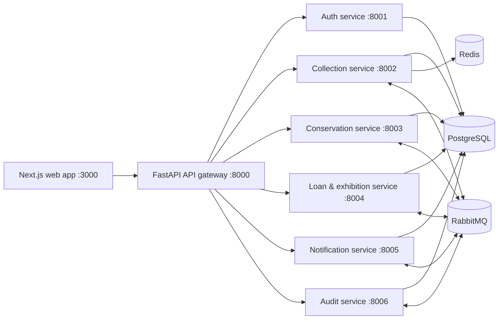
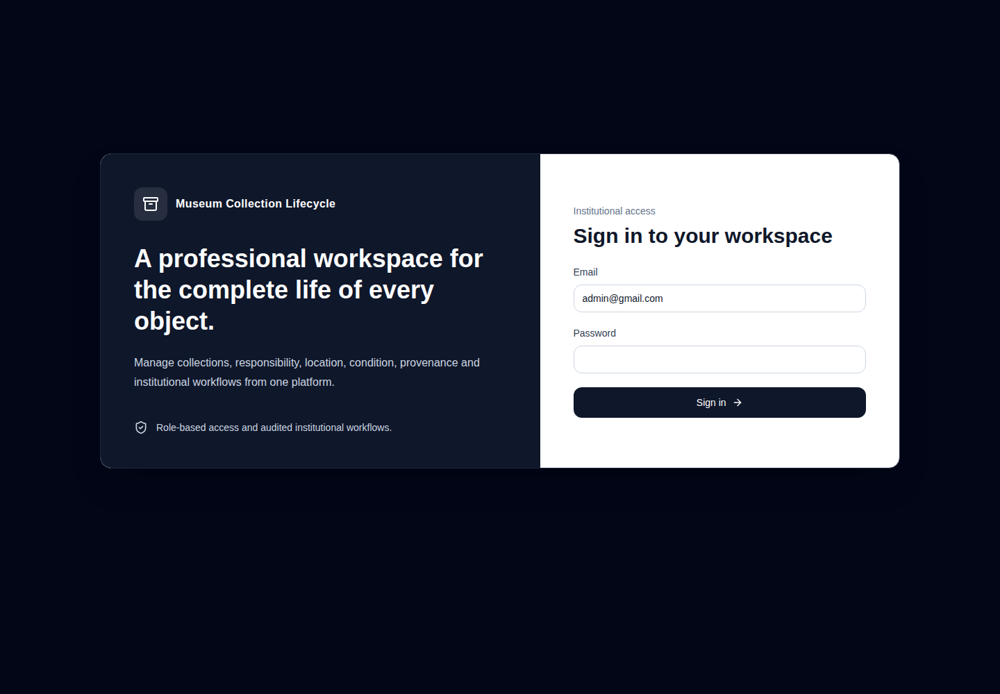
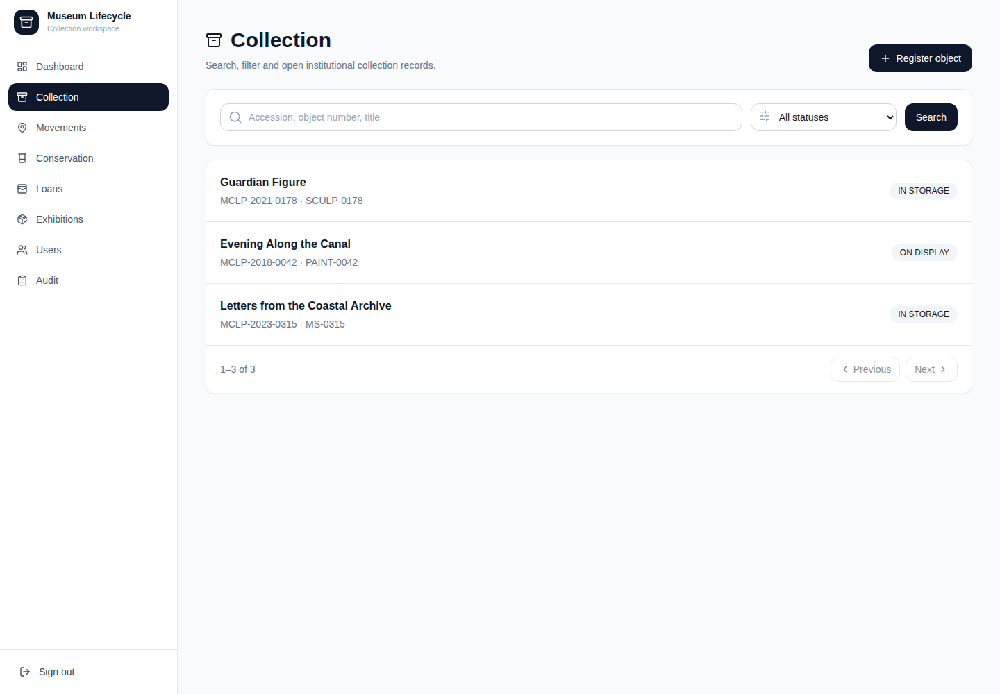
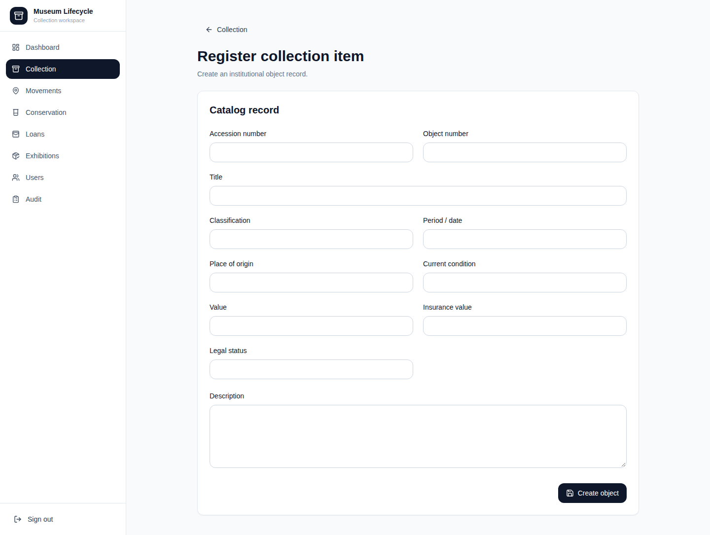
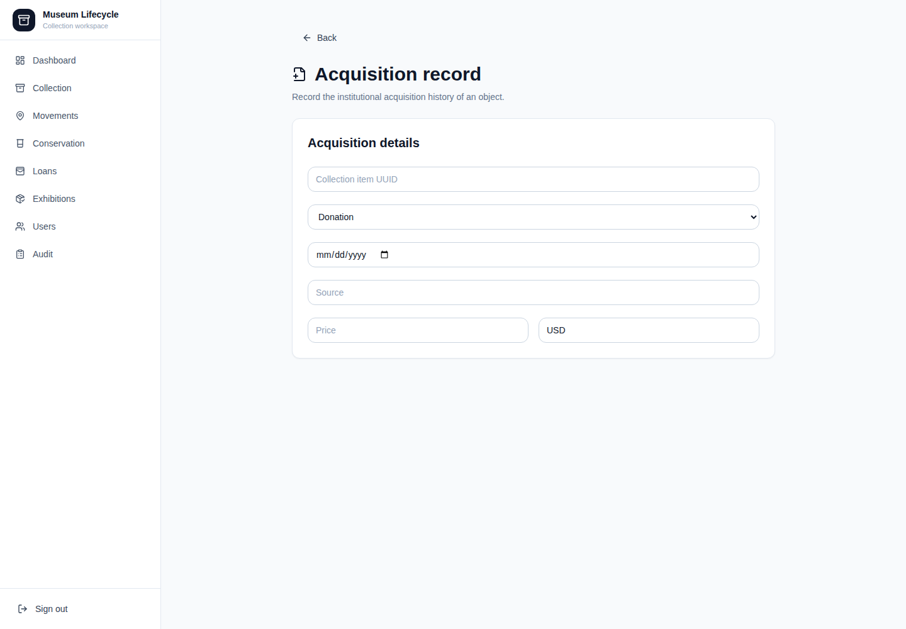
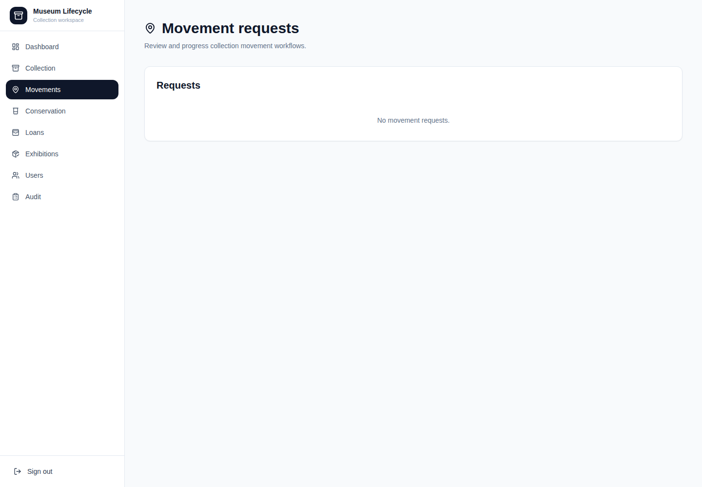
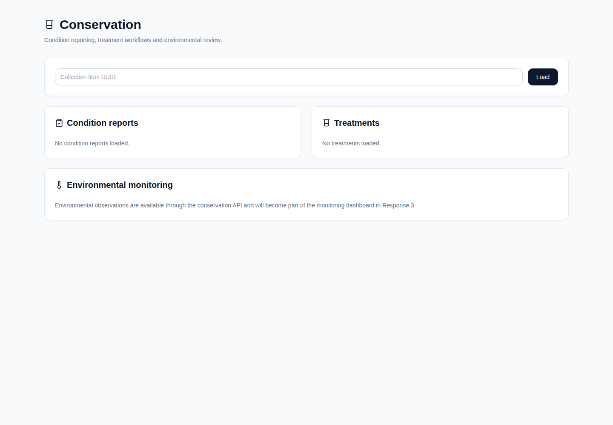

# Museum Collection Lifecycle Platform

The Museum Collection Lifecycle Platform is a full-stack collection-management workspace for museums and cultural institutions. It centralizes cataloging, acquisitions, provenance, location movements, conservation, loans, exhibitions, notifications, and audit history behind a role-aware API and web application.

## What the platform does

### Collection management

- Create, search, filter, sort, and update collection items.
- Store accession and object numbers, title, description, classification, culture, period, dimensions, techniques, origin, ownership/legal status, condition, value, insurance value, notes, creators, and materials.
- Filter the collection by status, object type, culture, material, creator, location, and acquisition date range.
- Record acquisition events and supporting legal documentation.
- Maintain chronological provenance records.
- Manage hierarchical locations such as buildings, floors, storage areas, rooms, and galleries.
- Request and approve item movements through `REQUESTED → APPROVED → IN_TRANSIT → COMPLETED` (with rejection and cancellation paths).
- Automatically update an item’s location and display/storage status when a movement is completed.
- Upload and download collection attachments with MIME type, checksum, image type, photographer, caption, and file metadata.
- Generate QR codes linking back to collection items.
- Use optimistic versioning to detect conflicting edits.

### Conservation

- Create and review condition reports with condition scores, observed damage, environmental concerns, recommendations, inspector, and report date.
- Create conservation treatments, track conservator and dates, and update treatment status.
- Record environmental observations for storage areas.
- Surface conservation work in the dashboard, including treatments in progress and environmental warnings.

### Loans and exhibition foundation

- Create and list incoming or outgoing loans with parties, dates, insurance value, and status.
- Transition loan statuses through the loan workflow.
- The loan service includes exhibition tables/models and counts upcoming planned exhibitions in the dashboard.
- The frontend includes an Exhibitions workspace and client methods for creating and changing exhibitions.
- Exhibition route handlers are not yet implemented in the current loan-service API; see [Current implementation notes](#current-implementation-notes).

### Security and administration

- JWT access tokens with rotating refresh tokens.
- Refresh tokens are also supported through an HTTP-only `museum_refresh_token` cookie.
- Password hashing, active/verified users, logout and token revocation.
- Permission-based authorization for users, roles, collection records, movements, conservation, loans, audit, and settings.
- Seeded system roles: `ADMIN`, `CURATOR`, `CONSERVATOR`, `REGISTRAR`, `RESEARCHER`, and `VIEWER`.
- User administration: list, create, activate/deactivate, inspect, and assign roles.

### Notifications, audit, and operations

- Consume domain events and expose user-specific notifications.
- Mark one notification or all notifications as read.
- Persist audit events and filter audit history by entity type and entity ID.
- Aggregate collection, conservation, and loan metrics into one dashboard response, including degraded-service information when an upstream is unavailable.
- Propagate an `X-Correlation-Id` through gateway requests and responses.
- Expose health/readiness endpoints and Prometheus metrics.

## Architecture



The API gateway is the public entry point. Domain services publish events through RabbitMQ; consumers in conservation, loans, notifications, and audit react asynchronously. Collection search and dashboard responses use Redis caching, and collection changes are published through an outbox publisher.

## Screenshots

The screenshots below show the responsive web application running in the local Docker Compose environment.

### Sign-in




### Collection workflows









### Conservation



## Technology stack

| Layer | Technologies |
| --- | --- |
| Frontend | Next.js 15, React 19, TypeScript, Tailwind CSS, TanStack Query, React Hook Form, Zod, Recharts, Lucide |
| Backend | Python 3.12, FastAPI, Uvicorn, SQLAlchemy, Alembic, Pydantic Settings |
| Security | PyJWT, bcrypt, permission-based authorization |
| Data and messaging | PostgreSQL, Redis, RabbitMQ, Pika |
| Files and media | Local storage volumes, Pillow, QRCode |
| Observability | Prometheus instrumentation, health/readiness endpoints, correlation IDs |
| Tests | Pytest, pytest-asyncio, HTTPX, frontend Playwright flow (currently disabled in filename) |

## Service map

| Service | Port | Responsibility |
| --- | ---: | --- |
| `api-gateway` | 8000 | Public API, proxying, CORS, dashboard aggregation, correlation IDs, metrics |
| `auth-service` | 8001 | Login, refresh/logout, users, roles, permissions, migrations, admin seed |
| `collection-service` | 8002 | Collection catalog, acquisitions, provenance, locations, movements, files, QR, dashboard |
| `conservation-service` | 8003 | Condition reports, treatments, environmental observations |
| `loan-service` | 8004 | Loans and exhibition data model/dashboard |
| `notification-service` | 8005 | User notifications and read state |
| `audit-service` | 8006 | Event consumer and audit history |

## Quick start

### Prerequisites

- Docker Engine and Docker Compose v2
- Python 3.12 for local development and seeding
- Node.js 22+ and pnpm (or npm) for frontend development
- PostgreSQL, Redis, and RabbitMQ reachable at the addresses in `.env`

The current `docker-compose.yml` uses `network_mode: host` and intentionally does not provision PostgreSQL, Redis, or RabbitMQ containers. Start those dependencies separately, or point the environment variables at an existing development instance.

### Configure the environment

```bash
cp .env.example .env
```

At minimum, change `DATABASE_PASSWORD`, `JWT_SECRET`, `RABBITMQ_PASSWORD`, and `SEED_ADMIN_PASSWORD`. Use a long, random JWT secret and never commit `.env`.

### Database migrations and seed data

Install the service dependencies in the local Python environments, then run the included development seed script from the project root:

```bash
chmod +x scripts/seed-development.sh
./scripts/seed-development.sh
```

The script applies the auth, collection, conservation, loan, notification, and audit migrations, creates the system roles and permissions, and seeds the configured administrator. The administrator credentials are read from `.env` (`SEED_ADMIN_EMAIL` and `SEED_ADMIN_PASSWORD`).

### Run services locally

Install dependencies per service and start each process on the port shown above. For example:

```bash
cd backend/api-gateway
python -m venv .venv
source .venv/bin/activate
pip install -r requirements.txt
uvicorn app.main:app --reload --port 8000
```

Repeat for the domain services, using their configured port. Start the frontend in another terminal:

```bash
cd frontend
pnpm install
pnpm dev
```

The web app is available at [http://localhost:3000](http://localhost:3000), and it calls the gateway through `/api/v1` by default.

### Docker images

The backend Dockerfiles install dependencies offline from `build/wheels`. Before running `docker compose build`, make sure each backend service has a populated `build/wheels` directory containing the wheels required by its `requirements.txt`; this wheelhouse is not generated by Compose. Then run:

```bash
docker compose build
docker compose up -d
docker compose ps
```

Because services use host networking, verify that ports `8000–8006` are free and that the dependency hosts in `.env` are reachable from the Docker host.

## Web application areas

The frontend provides the following workspaces, subject to the signed-in user’s permissions:

- **Dashboard** — collection, conservation, loan, exhibition, and warning summaries.
- **Collection** — paginated search, item creation, detail view, metadata, provenance, acquisitions, attachments, and QR code.
- **Movements** — movement requests and status transitions.
- **Conservation** — condition reports, treatments, and environmental observations.
- **Loans** — loan records and status management.
- **Exhibitions** — exhibition workspace and planned exhibition view (backend routes pending).
- **Users** — user and role administration.
- **Audit** — searchable audit history.
- **Notifications** — unread and read event notifications.
- **Settings** — application settings workspace.

## API overview

Use `http://localhost:8000` through the gateway. Login is `POST /api/v1/auth/login` with an email and password. Send the returned access token as `Authorization: Bearer <token>` for protected requests; the gateway adds an `X-Correlation-Id` response header.

| Area | Gateway paths |
| --- | --- |
| Authentication | `/api/v1/auth/login`, `/refresh`, `/logout`, `/me` |
| Users and roles | `/api/v1/auth/users`, `/api/v1/auth/roles` |
| Collection | `/api/v1/collection/items`, `/locations`, `/movements`, `/attachments`, `/dashboard/summary` |
| Conservation | `/api/v1/conservation/condition-reports`, `/treatments`, `/environmental-observations`, `/dashboard/summary` |
| Loans | `/api/v1/loans`, `/api/v1/loans/dashboard/summary` |
| Notifications | `/api/v1/notifications`, `/read`, `/read-all` |
| Audit | `/api/v1/audit` |
| Operations | `/health`, `/ready`, `/metrics`, `/api/v1/dashboard/summary` |

FastAPI services also expose interactive OpenAPI documentation when run directly (`/docs` and `/redoc`).

## Roles and permissions

| Role | Intended use |
| --- | --- |
| `ADMIN` | Full administration and all permissions |
| `CURATOR` | Collection and exhibition management |
| `CONSERVATOR` | Condition and conservation work |
| `REGISTRAR` | Registration, acquisitions, movements, and loans |
| `RESEARCHER` | Controlled read access to collection, conservation, and loans |
| `VIEWER` | Read-only collection access |

Permission codes include `users:read`, `users:create`, `users:update`, `users:delete`, `roles:read`, `roles:update`, `collection:read`, `collection:create`, `collection:update`, `collection:delete`, `collection:move`, `conservation:read`, `conservation:write`, `loans:read`, `loans:write`, `audit:read`, and `settings:manage`.

## Testing

Run backend tests from a service directory after installing its requirements:

```bash
cd backend/collection-service
pytest
```

Run all backend test suites individually or with your preferred test runner. The frontend flow test is in `frontend/tests/auth-flow.spec.ts`; its Playwright configuration is currently named `playwright.config.ts.disabled`, so rename/enable it before running browser tests.

Useful checks after startup:

```bash
curl http://localhost:8000/health
curl http://localhost:8000/ready
curl http://localhost:8000/metrics
```

## Repository layout

```text
backend/
  api-gateway/           Public FastAPI gateway and dashboard aggregation
  auth-service/          JWT auth, users, roles, permissions, seed data
  collection-service/    Catalog, acquisitions, provenance, movement, files, QR
  conservation-service/  Conditions, treatments, environmental observations
  loan-service/          Loans and exhibition data model/dashboard
  notification-service/  User notifications
  audit-service/         Event consumer and audit history
frontend/                Next.js museum operations interface
infrastructure/          Prometheus and Grafana configuration
scripts/                 Development migrations and seed workflow
storage/                 Persistent collection, conservation, document, exhibition, and loan files
docker-compose.yml       Container definitions for application services
```

## Configuration reference

The main `.env` groups are:

- `DATABASE_*` — PostgreSQL connection.
- `REDIS_*` — collection cache connection.
- `RABBITMQ_*` — event bus connection.
- `JWT_*`, `ACCESS_TOKEN_EXPIRE_MINUTES`, `REFRESH_TOKEN_EXPIRE_DAYS` — authentication.
- `SEED_ADMIN_*` — development administrator.
- `*_SERVICE_HOST` and `*_SERVICE_PORT` — service bind addresses.
- `*_SERVICE_URL` — gateway upstream URLs.
- `FILE_STORAGE_PATH` and `PUBLIC_FRONTEND_URL` — uploaded files and QR links.
- `NEXT_PUBLIC_API_BASE_URL`, `API_GATEWAY_URL`, and `CORS_ALLOWED_ORIGINS` — frontend/gateway connectivity.

## Current implementation notes

- The Compose file uses host networking and expects PostgreSQL, Redis, and RabbitMQ to be provided separately.
- Backend images install dependencies from an offline `build/wheels` directory. A wheelhouse must be prepared before those images can be built.
- The frontend has an Exhibitions screen and calls `/api/v1/loans/exhibitions*`, while the current loan-service router exposes loans and the upcoming-exhibitions dashboard count only. Implement or connect those exhibition endpoints before treating exhibition management as production-ready.
- The frontend Playwright configuration is intentionally disabled by filename (`playwright.config.ts.disabled`) and must be enabled before browser tests can run.

## License

This project is licensed under the [MIT License](LICENSE).
